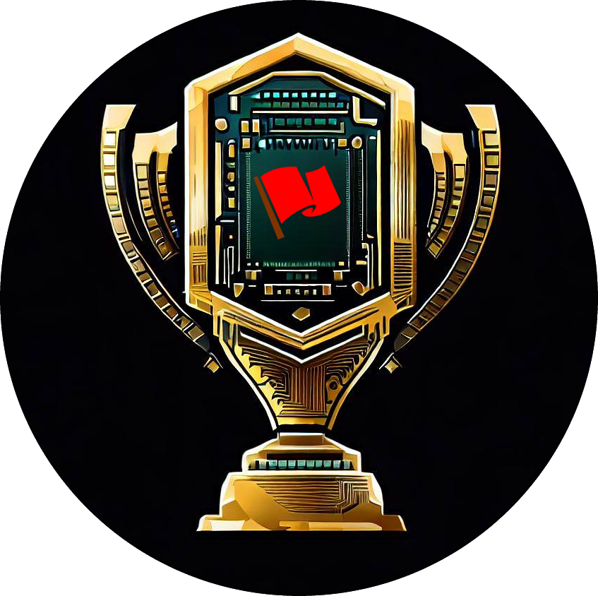

<p align="center">
  
</p>

<h2 align="center"><b>CTFPad</b></h2>
<h3 align="center">Where CTF happen</h3>

<p align="center">
  <a href="https://github.com/psf/black"></a>
  <a href="https://github.com/hugsy/ctfpad/blob/master/LICENSE"></a>
  
  <a href="https://discord.gg/fYsAjvsdQT"></a>
</p>

## What is it?

A collaborative environment for teams playing [CTFs](https://en.wikipedia.org/wiki/Wargame_(hacking)). It provides out-of-the-box everything to manage and collaborate on the CTFs and challenges you and your team are working on.

_Note_: If you're looking for a platform for hosting CTFs use [CTFd](https://github.com/ctfd/ctfd).


## Features

A non-exhaustive list of features:

 - Full Django + Python 3.10 code
 - Clean (Bootstrap 5+) interface
 - Key-in-hands setup via [`docker-compose`](https://docs.docker.com/compose)
 - Fully integrated around [HedgeDoc](https://github.com/hedgedoc/hedgedoc): smart markdown note mechanism, with [tons of features](https://demo.hedgedoc.org/features)
 - Possibility to create and play private CTFs
 - Create "guests" to your CTFs
 - View CTF stats, and track members' involment through a cool podium ranking
 - [Jitsi](https://meet.jit.si) integration: instantly jump on video chat with your team mate
 - CTFTime integration: import CTF (+ data) from CTFTime in 2 clicks
 - CTFd/rCTF challenge(s) can optionally be pre-populated locally
 - Basic search engine
 - One step "challenge-notes" → "blog post" export feature
 - Public & Self-hosted [Excalidraw](https://github.com/excalidraw/excalidraw) integration: draw & share ideas with your team mates
 - Discord notifications
 - ...and more to come...
 - and of course, a Dark mode


## Build


For most people, this will suffice:

```bash
$ git clone https://github.com/hugsy/ctfpad
$ cd ctfpad
$ cp .env.example .env
### CHANGE THE CREDENTIALS IN .env ###
$ nano .env
### BUILD EXCALIDRAW USING .env VARIABLES ###
$ make build
$ docker compose up -d --build
```

If you want to use SSL locally, follow the [instructions to generate local SSL certificates](./conf/certs/README.md)
and run:

```bash
$ cp scripts/proxy/.env.nginx-proxy.example scripts/proxy/.env
$ nano scripts/proxy/.env
### Edit the file to your need
$ docker compose -f scripts/proxy/docker-compose.yml -f ./docker-compose.yml up -d --build
```


## Contribution

`CTFPad` was created and maintained by [`@_hugsy_`](https://twitter.com/_hugsy_), but kept fresh thanks to [all the contributors](https://github.com/hugsy/ctfpad/graphs/contributors).

[  ](https://github.com/hugsy/ctfpad/graphs/contributors)


If you just like the tool, consider dropping on Discord (or Twitter or other) a simple *"thanks"*, it is always very appreciated.

And if you can, consider [sponsoring me](https://github.com/hugsy/sponsors) - it really helps dedicating time and resources to the projects!


## Extra Credits

- [CTFPad](https://github.com/StratumAuhuur/CTFPad): nice project but NodeJS, so yeah. Also [`etherpad-lite`](https://yopad.eu) doesn't support MarkDown easily. I like the name, so I took it shamelessly
- The world flag images are downloaded from https://flagpedia.net/
